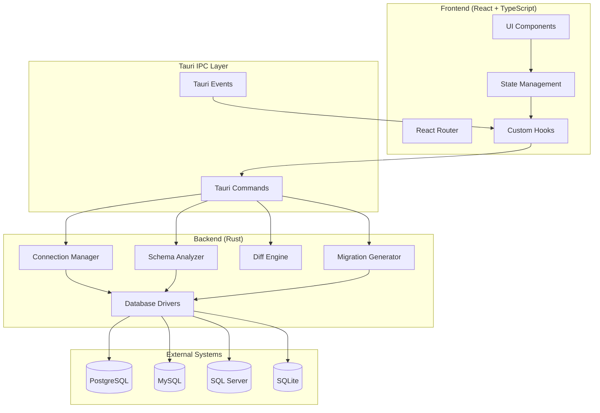
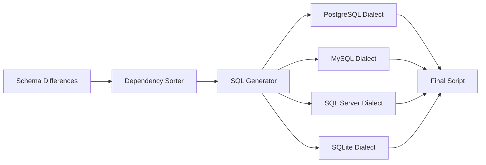
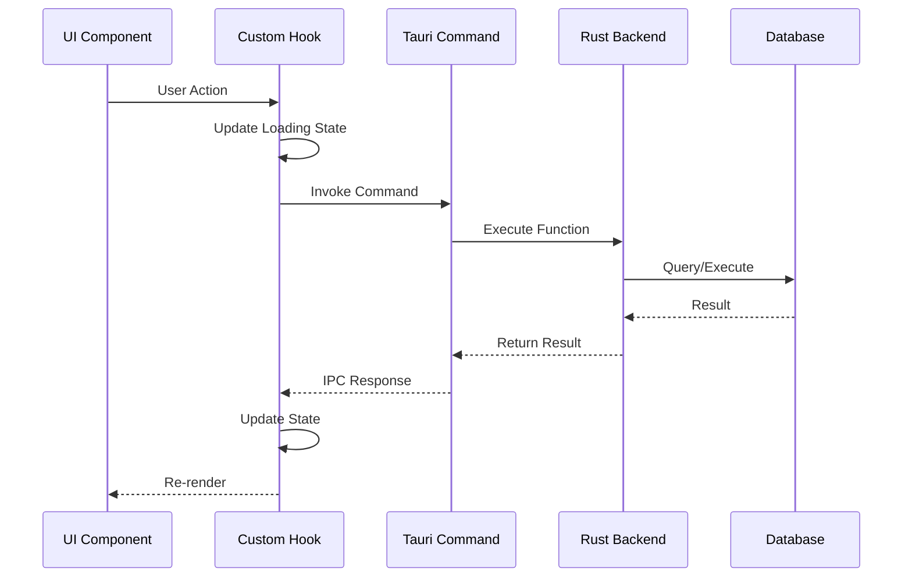

# Design Document: SyncroDB Schema Synchronization

## Overview

SyncroDB is a desktop application built with React, TypeScript, and Tauri that enables database professionals to synchronize schemas between databases. The system transforms existing static HTML mockups into functional React components connected to a Rust backend that performs database operations.

The architecture follows a clear separation between the frontend (React/TypeScript) and backend (Rust/Tauri), with the frontend handling UI interactions and the backend managing database connections, schema analysis, and SQL generation. Communication occurs through Tauri's IPC (Inter-Process Communication) mechanism using typed commands.

### Core User Flow

1. User manages database connections through the Connection Grid
2. User selects source and target databases for comparison
3. System analyzes both schemas and identifies differences
4. User reviews differences in the Schema Deep-Dive view
5. User previews migration operations in the Safe-Sync Preview Modal
6. System generates migration SQL script
7. User reviews/edits script in the Migration Script Editor
8. User executes migration with real-time monitoring

### Technology Stack

- **Frontend**: React 18 + TypeScript + Vite + React Router
- **Backend**: Rust + Tauri 2.0
- **Database Drivers**: SQLx (Rust) for PostgreSQL, MySQL, SQLite, SQL Server
- **State Management**: React Context API + Custom Hooks
- **UI Components**: Custom components matching cyber-industrial design
- **Code Editor**: Monaco Editor (VS Code editor component)

## Architecture

### System Architecture Diagram



### Component Architecture

The system is organized into distinct layers:

**Presentation Layer (React Components)**
- Dashboard/Connection Grid: Manages database connections
- Schema Deep-Dive: Displays side-by-side schema comparison
- Safe-Sync Preview Modal: Shows migration operations for review
- Migration Script Editor: Edits and executes SQL scripts
- Connection Config: Configures database connection parameters

**Application Layer (React Hooks & State)**
- useConnections: Manages connection state and operations
- useSchemaComparison: Handles schema analysis workflow
- useMigrationScript: Manages script generation and execution
- AppContext: Global application state

**Backend Layer (Rust/Tauri)**
- Connection Manager: Handles database connections and credential storage
- Schema Analyzer: Extracts schema metadata from databases
- Diff Engine: Compares schemas and identifies differences
- Migration Generator: Creates SQL migration scripts
- Executor: Runs migrations with transaction management

**Data Layer (Database Drivers)**
- SQLx-based drivers for each database type
- Connection pooling and query execution
- Schema introspection queries


## Components and Interfaces

### Frontend Components

#### 1. Connection Grid Component

**Purpose**: Manage database connections and initiate schema comparison

**Props Interface**:
```typescript
interface ConnectionGridProps {
  connections: DatabaseConnection[];
  onAddConnection: (connection: DatabaseConnection) => Promise<void>;
  onEditConnection: (id: string, connection: DatabaseConnection) => Promise<void>;
  onDeleteConnection: (id: string) => Promise<void>;
  onTestConnection: (id: string) => Promise<ConnectionTestResult>;
  onSelectForComparison: (sourceId: string, targetId: string) => void;
}
```

**State Management**:
- Local state for UI interactions (selection, modals)
- Global state for connection list (via useConnections hook)
- Loading states for async operations

**Key Interactions**:
- Add/Edit/Delete connections
- Test connection validity
- Select source and target for comparison
- Navigate to schema comparison view

#### 2. Schema Deep-Dive Component

**Purpose**: Display side-by-side schema comparison with detailed differences

**Props Interface**:
```typescript
interface SchemaDeepDiveProps {
  sourceSchema: DatabaseSchema;
  targetSchema: DatabaseSchema;
  differences: SchemaDifference[];
  onGenerateMigration: () => void;
}
```

**Features**:
- Tabular display of schema objects
- Side-by-side comparison view
- Difference highlighting (additions, modifications, deletions)
- Expandable rows for detailed object inspection
- Filter and search capabilities

#### 3. Safe-Sync Preview Modal Component

**Purpose**: Preview migration operations before execution

**Props Interface**:
```typescript
interface SafeSyncPreviewProps {
  operations: MigrationOperation[];
  onApprove: (selectedOps: string[]) => void;
  onCancel: () => void;
}
```

**Features**:
- Categorize operations (destructive vs additive)
- Display SQL for each operation
- Selective approval checkboxes
- Warning indicators for destructive actions
- Estimated impact information

#### 4. Migration Script Editor Component

**Purpose**: Edit and execute SQL migration scripts

**Props Interface**:
```typescript
interface MigrationScriptEditorProps {
  script: string;
  onScriptChange: (script: string) => void;
  onExecute: () => Promise<ExecutionResult>;
  onSave: (filename: string) => Promise<void>;
  targetDatabase: DatabaseConnection;
}
```

**Features**:
- Monaco Editor integration with SQL syntax highlighting
- Real-time syntax validation
- Execute button with confirmation
- Save to file system
- Execution progress and results display

#### 5. Connection Config Component

**Purpose**: Configure database connection parameters

**Props Interface**:
```typescript
interface ConnectionConfigProps {
  connection?: DatabaseConnection;
  onSave: (connection: DatabaseConnection) => Promise<void>;
  onCancel: () => void;
}
```

**Features**:
- Form for connection parameters
- Database type selection
- SSL/TLS options
- Connection string builder
- Test connection button

### Backend Tauri Commands

#### Connection Management Commands

```rust
#[tauri::command]
async fn add_connection(connection: DatabaseConnection) -> Result<String, String>

#[tauri::command]
async fn update_connection(id: String, connection: DatabaseConnection) -> Result<(), String>

#[tauri::command]
async fn delete_connection(id: String) -> Result<(), String>

#[tauri::command]
async fn list_connections() -> Result<Vec<DatabaseConnection>, String>

#[tauri::command]
async fn test_connection(id: String) -> Result<ConnectionTestResult, String>
```

#### Schema Analysis Commands

```rust
#[tauri::command]
async fn analyze_schema(connection_id: String) -> Result<DatabaseSchema, String>

#[tauri::command]
async fn compare_schemas(
    source_id: String,
    target_id: String
) -> Result<SchemaComparison, String>
```

#### Migration Commands

```rust
#[tauri::command]
async fn generate_migration_script(
    comparison: SchemaComparison,
    selected_operations: Vec<String>
) -> Result<String, String>

#[tauri::command]
async fn execute_migration(
    target_id: String,
    script: String
) -> Result<ExecutionResult, String>

#[tauri::command]
async fn save_script_to_file(
    script: String,
    filename: String
) -> Result<(), String>
```

### Custom React Hooks

#### useConnections Hook

```typescript
interface UseConnectionsReturn {
  connections: DatabaseConnection[];
  loading: boolean;
  error: string | null;
  addConnection: (conn: DatabaseConnection) => Promise<void>;
  updateConnection: (id: string, conn: DatabaseConnection) => Promise<void>;
  deleteConnection: (id: string) => Promise<void>;
  testConnection: (id: string) => Promise<ConnectionTestResult>;
  refreshConnections: () => Promise<void>;
}

function useConnections(): UseConnectionsReturn
```

#### useSchemaComparison Hook

```typescript
interface UseSchemaComparisonReturn {
  sourceSchema: DatabaseSchema | null;
  targetSchema: DatabaseSchema | null;
  comparison: SchemaComparison | null;
  loading: boolean;
  error: string | null;
  compareSchemas: (sourceId: string, targetId: string) => Promise<void>;
  reset: () => void;
}

function useSchemaComparison(): UseSchemaComparisonReturn
```

#### useMigrationScript Hook

```typescript
interface UseMigrationScriptReturn {
  script: string;
  loading: boolean;
  error: string | null;
  executionResult: ExecutionResult | null;
  generateScript: (comparison: SchemaComparison, ops: string[]) => Promise<void>;
  updateScript: (newScript: string) => void;
  executeScript: (targetId: string) => Promise<void>;
  saveScript: (filename: string) => Promise<void>;
}

function useMigrationScript(): UseMigrationScriptReturn
```


## Data Models

### Frontend Data Models (TypeScript)

```typescript
// Database Connection
interface DatabaseConnection {
  id: string;
  name: string;
  type: DatabaseType;
  host: string;
  port: number;
  database: string;
  username: string;
  password: string; // Encrypted in storage
  ssl: boolean;
  sslConfig?: SSLConfig;
  createdAt: string;
  updatedAt: string;
}

enum DatabaseType {
  PostgreSQL = "postgresql",
  MySQL = "mysql",
  SQLServer = "sqlserver",
  SQLite = "sqlite"
}

interface SSLConfig {
  mode: "require" | "verify-ca" | "verify-full";
  ca?: string;
  cert?: string;
  key?: string;
}

// Connection Test Result
interface ConnectionTestResult {
  success: boolean;
  message: string;
  latency?: number;
  serverVersion?: string;
}

// Database Schema
interface DatabaseSchema {
  connectionId: string;
  databaseName: string;
  tables: Table[];
  views: View[];
  procedures: StoredProcedure[];
  functions: Function[];
  triggers: Trigger[];
  sequences: Sequence[];
  analyzedAt: string;
}

interface Table {
  name: string;
  schema: string;
  columns: Column[];
  primaryKey?: PrimaryKey;
  foreignKeys: ForeignKey[];
  uniqueConstraints: UniqueConstraint[];
  checkConstraints: CheckConstraint[];
  indexes: Index[];
  rowCount?: number;
}

interface Column {
  name: string;
  dataType: string;
  nullable: boolean;
  defaultValue?: string;
  autoIncrement: boolean;
  comment?: string;
  ordinalPosition: number;
}

interface PrimaryKey {
  name: string;
  columns: string[];
}

interface ForeignKey {
  name: string;
  columns: string[];
  referencedTable: string;
  referencedColumns: string[];
  onDelete: ReferentialAction;
  onUpdate: ReferentialAction;
}

enum ReferentialAction {
  NoAction = "NO ACTION",
  Cascade = "CASCADE",
  SetNull = "SET NULL",
  SetDefault = "SET DEFAULT",
  Restrict = "RESTRICT"
}

interface UniqueConstraint {
  name: string;
  columns: string[];
}

interface CheckConstraint {
  name: string;
  expression: string;
}

interface Index {
  name: string;
  columns: string[];
  unique: boolean;
  type: IndexType;
  partial: boolean;
  condition?: string;
}

enum IndexType {
  BTree = "BTREE",
  Hash = "HASH",
  GiST = "GIST",
  GIN = "GIN",
  BRIN = "BRIN"
}

interface View {
  name: string;
  schema: string;
  definition: string;
}

interface StoredProcedure {
  name: string;
  schema: string;
  parameters: Parameter[];
  definition: string;
}

interface Function {
  name: string;
  schema: string;
  parameters: Parameter[];
  returnType: string;
  definition: string;
}

interface Parameter {
  name: string;
  dataType: string;
  mode: "IN" | "OUT" | "INOUT";
}

interface Trigger {
  name: string;
  table: string;
  timing: "BEFORE" | "AFTER" | "INSTEAD OF";
  event: "INSERT" | "UPDATE" | "DELETE";
  definition: string;
}

interface Sequence {
  name: string;
  schema: string;
  startValue: number;
  increment: number;
  minValue?: number;
  maxValue?: number;
  cycle: boolean;
}

// Schema Comparison
interface SchemaComparison {
  sourceId: string;
  targetId: string;
  differences: SchemaDifference[];
  summary: ComparisonSummary;
  comparedAt: string;
}

interface SchemaDifference {
  id: string;
  objectType: SchemaObjectType;
  objectName: string;
  changeType: ChangeType;
  sourceValue?: any;
  targetValue?: any;
  details: string;
  destructive: boolean;
}

enum SchemaObjectType {
  Table = "table",
  Column = "column",
  PrimaryKey = "primary_key",
  ForeignKey = "foreign_key",
  UniqueConstraint = "unique_constraint",
  CheckConstraint = "check_constraint",
  Index = "index",
  View = "view",
  Procedure = "procedure",
  Function = "function",
  Trigger = "trigger",
  Sequence = "sequence"
}

enum ChangeType {
  Addition = "addition",
  Modification = "modification",
  Deletion = "deletion"
}

interface ComparisonSummary {
  totalDifferences: number;
  additions: number;
  modifications: number;
  deletions: number;
  destructiveChanges: number;
}

// Migration Operation
interface MigrationOperation {
  id: string;
  differenceId: string;
  sql: string;
  description: string;
  destructive: boolean;
  estimatedImpact?: ImpactEstimate;
  approved: boolean;
}

interface ImpactEstimate {
  affectedRows?: number;
  executionTimeMs?: number;
}

// Execution Result
interface ExecutionResult {
  success: boolean;
  operations: OperationResult[];
  totalDuration: number;
  error?: string;
}

interface OperationResult {
  sql: string;
  success: boolean;
  duration: number;
  rowsAffected?: number;
  error?: string;
}
```

### Backend Data Models (Rust)

```rust
use serde::{Deserialize, Serialize};
use sqlx::FromRow;

// Database Connection (stored encrypted)
#[derive(Debug, Clone, Serialize, Deserialize)]
pub struct DatabaseConnection {
    pub id: String,
    pub name: String,
    pub db_type: DatabaseType,
    pub host: String,
    pub port: u16,
    pub database: String,
    pub username: String,
    pub password: String, // Encrypted
    pub ssl: bool,
    pub ssl_config: Option<SSLConfig>,
    pub created_at: String,
    pub updated_at: String,
}

#[derive(Debug, Clone, Serialize, Deserialize)]
#[serde(rename_all = "lowercase")]
pub enum DatabaseType {
    PostgreSQL,
    MySQL,
    SQLServer,
    SQLite,
}

#[derive(Debug, Clone, Serialize, Deserialize)]
pub struct SSLConfig {
    pub mode: String,
    pub ca: Option<String>,
    pub cert: Option<String>,
    pub key: Option<String>,
}

// Schema metadata structures
#[derive(Debug, Clone, Serialize, Deserialize)]
pub struct DatabaseSchema {
    pub connection_id: String,
    pub database_name: String,
    pub tables: Vec<Table>,
    pub views: Vec<View>,
    pub procedures: Vec<StoredProcedure>,
    pub functions: Vec<Function>,
    pub triggers: Vec<Trigger>,
    pub sequences: Vec<Sequence>,
    pub analyzed_at: String,
}

#[derive(Debug, Clone, Serialize, Deserialize, FromRow)]
pub struct Table {
    pub name: String,
    pub schema: String,
    pub columns: Vec<Column>,
    pub primary_key: Option<PrimaryKey>,
    pub foreign_keys: Vec<ForeignKey>,
    pub unique_constraints: Vec<UniqueConstraint>,
    pub check_constraints: Vec<CheckConstraint>,
    pub indexes: Vec<Index>,
    pub row_count: Option<i64>,
}

#[derive(Debug, Clone, Serialize, Deserialize)]
pub struct Column {
    pub name: String,
    pub data_type: String,
    pub nullable: bool,
    pub default_value: Option<String>,
    pub auto_increment: bool,
    pub comment: Option<String>,
    pub ordinal_position: i32,
}

// Additional Rust structures follow similar pattern...
```


## Correctness Properties

*A property is a characteristic or behavior that should hold true across all valid executions of a system-essentially, a formal statement about what the system should do. Properties serve as the bridge between human-readable specifications and machine-verifiable correctness guarantees.*

### Property Reflection

After analyzing all acceptance criteria, I identified several areas where properties can be consolidated:

**Redundancy Analysis:**
- Properties 2.1, 2.2, 8.1, 8.2, 8.3, 8.4, 8.5 all relate to comprehensive schema extraction and can be combined into a single property about complete schema analysis
- Properties 2.3, 2.4, 2.7 all relate to diff detection and can be combined into one comprehensive diff property
- Properties 3.1, 3.3 relate to operation categorization and SQL generation and can be combined
- Properties 4.1, 4.2, 4.3, 8.7 all relate to SQL generation correctness and can be combined
- Properties 5.4, 5.6 both relate to execution reporting and can be combined
- Properties 7.1, 7.2 both relate to credential security and can be combined

### Core Properties

### Property 1: Connection Persistence Round-Trip

*For any* set of database connections, saving them to storage and then loading them back should produce equivalent connection configurations with encrypted passwords preserved.

**Validates: Requirements 1.6**

### Property 2: Connection Validation

*For any* database connection parameters, the system should validate the parameters and return either a successful connection test result with server information or a specific error message with diagnostic details.

**Validates: Requirements 1.2, 1.3**

### Property 3: Comprehensive Schema Extraction

*For any* database connection, the schema analyzer should extract all supported schema objects including tables (with columns, data types, nullability), primary keys, foreign keys, unique constraints, check constraints, indexes (all types), views, stored procedures, functions, triggers, sequences, and database-specific objects, with warnings logged for unsupported objects.

**Validates: Requirements 2.1, 2.2, 8.1, 8.2, 8.3, 8.4, 8.5, 8.6**

### Property 4: Complete Difference Detection

*For any* two database schemas, the diff engine should identify all differences at granular levels (table, column, constraint, index) and categorize each difference as addition, modification, or deletion with correct destructive/additive classification.

**Validates: Requirements 2.3, 2.4, 2.7, 3.1**

### Property 5: Difference Report Generation

*For any* schema comparison, the system should generate a comprehensive difference report containing all identified differences with summary statistics (total, additions, modifications, deletions, destructive changes).

**Validates: Requirements 2.8**

### Property 6: SQL Generation Correctness

*For any* set of approved migration operations and target database type, the migration generator should create syntactically valid SQL scripts in the correct dialect for that database type, with transaction boundaries (BEGIN/COMMIT/ROLLBACK) and appropriate SQL statements for all supported schema object types.

**Validates: Requirements 4.1, 4.2, 4.3, 8.7**

### Property 7: SQL Syntax Validation

*For any* SQL script input, the syntax validator should correctly identify whether the SQL is syntactically valid or invalid and return appropriate validation results.

**Validates: Requirements 4.6**

### Property 8: Script File Round-Trip

*For any* migration script, saving it to the file system and then reading it back should produce the identical script content.

**Validates: Requirements 4.7**

### Property 9: Transaction Rollback on Failure

*For any* migration script execution where at least one operation fails, the system should automatically rollback the entire transaction and report the error, leaving the database in its original state.

**Validates: Requirements 5.1, 5.2**

### Property 10: Execution Logging and Reporting

*For any* migration execution (successful or failed), the system should log all executed SQL statements with timestamps and generate a detailed execution report including success/failure status, duration, and rows affected for each operation.

**Validates: Requirements 5.4, 5.6**

### Property 11: Post-Migration Schema Verification

*For any* successfully completed migration from source to target database, comparing the schemas again should show zero differences (schemas should match).

**Validates: Requirements 5.5**

### Property 12: Credential Encryption and Security

*For any* database connection with credentials, the stored credentials should be encrypted (not plain text), and passwords should never appear in plain text in any logs, error messages, or UI displays.

**Validates: Requirements 7.1, 7.2**

### Property 13: Read-Only Mode Safety

*For any* database operations performed in read-only analysis mode, no modifications should be made to the database (all write operations should be prevented).

**Validates: Requirements 7.4**

### Property 14: Destructive Operation Confirmation

*For any* migration containing destructive operations, execution should be blocked until all destructive operations are explicitly acknowledged by the user.

**Validates: Requirements 3.5, 7.5**

### Property 15: Migration Script Backup

*For any* migration script execution, an automatic backup of the script should be created before execution begins.

**Validates: Requirements 7.6**

### Property 16: UI Preferences Persistence

*For any* user interface preferences and window layouts, saving them and restarting the application should restore the same preferences and layouts.

**Validates: Requirements 6.7**

### Property 17: Large Schema Performance

*For any* database schema with 1000 or more tables, the system should maintain responsive performance (schema analysis completing within reasonable time limits and UI remaining responsive).

**Validates: Requirements 6.6**

### Property 18: Keyboard Shortcut Functionality

*For any* primary operation with a defined keyboard shortcut, triggering the shortcut should execute the same action as the UI button/menu item.

**Validates: Requirements 6.5**

### Property 19: SSL/TLS Connection Support

*For any* database connection configured with SSL/TLS enabled, the system should establish an encrypted connection to the database.

**Validates: Requirements 7.3**

### Property 20: Permission Validation

*For any* schema modification operation, the system should validate that the user has sufficient permissions before attempting the modification, and report permission errors if insufficient.

**Validates: Requirements 7.7**


## Error Handling

### Error Categories

The system handles errors across multiple layers with consistent error propagation and user-friendly messaging:

#### 1. Connection Errors

**Types:**
- Network connectivity failures
- Authentication failures
- SSL/TLS certificate errors
- Database not found
- Timeout errors

**Handling Strategy:**
- Catch at Rust backend layer
- Return structured error with error code and diagnostic message
- Display in UI with specific remediation suggestions
- Log full error details for debugging
- Allow retry with exponential backoff

**Example Error Structure:**
```typescript
interface ConnectionError {
  code: "NETWORK_ERROR" | "AUTH_FAILED" | "SSL_ERROR" | "DB_NOT_FOUND" | "TIMEOUT";
  message: string;
  details: string;
  suggestion: string;
}
```

#### 2. Schema Analysis Errors

**Types:**
- Insufficient permissions to read schema
- Unsupported database version
- Corrupted schema metadata
- Query timeout on large schemas

**Handling Strategy:**
- Continue processing when possible (log warnings for unsupported objects)
- Return partial results with error annotations
- Provide clear indication of incomplete analysis
- Suggest permission grants or version upgrades

#### 3. Migration Generation Errors

**Types:**
- Unsupported schema object type
- Circular foreign key dependencies
- Invalid SQL generation for database dialect

**Handling Strategy:**
- Validate operations before SQL generation
- Detect circular dependencies and suggest resolution order
- Fall back to manual SQL for unsupported objects
- Provide template SQL for user customization

#### 4. Migration Execution Errors

**Types:**
- SQL syntax errors
- Constraint violations
- Insufficient permissions
- Deadlocks or lock timeouts
- Disk space errors

**Handling Strategy:**
- Wrap all operations in transactions
- Automatic rollback on any failure
- Capture exact error from database
- Provide line number and statement that failed
- Suggest remediation steps
- Save failed script for manual review

#### 5. File System Errors

**Types:**
- Permission denied
- Disk full
- File not found
- Invalid path

**Handling Strategy:**
- Validate paths before operations
- Check available disk space
- Provide clear error messages
- Suggest alternative locations

### Error Propagation Pattern

```
Database/File System
        ↓
Rust Backend (catch, log, structure)
        ↓
Tauri IPC (serialize error)
        ↓
React Hook (update error state)
        ↓
UI Component (display user-friendly message)
```

### Error Recovery Mechanisms

1. **Automatic Retry**: Network errors with exponential backoff
2. **Transaction Rollback**: All migration failures
3. **Partial Success**: Continue schema analysis despite individual object failures
4. **Graceful Degradation**: Disable features when dependencies unavailable
5. **State Recovery**: Persist application state before risky operations

### User Error Messaging Guidelines

- Use plain language, avoid technical jargon when possible
- Provide specific error details (not generic "An error occurred")
- Include actionable remediation steps
- Show error codes for support reference
- Link to documentation for complex errors
- Distinguish between user errors and system errors


## Testing Strategy

### Dual Testing Approach

The testing strategy employs both unit tests and property-based tests to ensure comprehensive coverage:

- **Unit tests**: Verify specific examples, edge cases, error conditions, and integration points
- **Property tests**: Verify universal properties across all inputs through randomization

Both approaches are complementary and necessary. Unit tests catch concrete bugs in specific scenarios, while property tests verify general correctness across a wide input space.

### Property-Based Testing Configuration

**Library Selection:**
- **Rust Backend**: Use `proptest` crate for property-based testing
- **TypeScript Frontend**: Use `fast-check` library for property-based testing

**Test Configuration:**
- Minimum 100 iterations per property test (due to randomization)
- Each property test must reference its design document property
- Tag format: `// Feature: syncrodb-schema-sync, Property {number}: {property_text}`

**Example Property Test Structure (Rust):**
```rust
#[cfg(test)]
mod tests {
    use proptest::prelude::*;
    
    // Feature: syncrodb-schema-sync, Property 1: Connection Persistence Round-Trip
    proptest! {
        #[test]
        fn test_connection_persistence_roundtrip(
            connections in prop::collection::vec(arbitrary_connection(), 1..10)
        ) {
            let storage = ConnectionStorage::new();
            storage.save_connections(&connections).unwrap();
            let loaded = storage.load_connections().unwrap();
            
            assert_eq!(connections.len(), loaded.len());
            for (original, loaded) in connections.iter().zip(loaded.iter()) {
                assert_eq!(original.id, loaded.id);
                assert_eq!(original.name, loaded.name);
                // Password should be encrypted but decryptable
                assert_ne!(original.password, loaded.password); // Encrypted
                assert_eq!(decrypt(&loaded.password), original.password);
            }
        }
    }
}
```

**Example Property Test Structure (TypeScript):**
```typescript
import fc from 'fast-check';

// Feature: syncrodb-schema-sync, Property 4: Complete Difference Detection
describe('Schema Diff Engine', () => {
  it('should detect all differences between schemas', () => {
    fc.assert(
      fc.property(
        fc.record({
          source: arbitrarySchema(),
          target: arbitrarySchema(),
        }),
        ({ source, target }) => {
          const differences = diffEngine.compare(source, target);
          
          // Verify all actual differences are detected
          const actualDiffs = computeActualDifferences(source, target);
          expect(differences.length).toBe(actualDiffs.length);
          
          // Verify each difference is correctly categorized
          differences.forEach(diff => {
            expect(['addition', 'modification', 'deletion']).toContain(diff.changeType);
            expect(typeof diff.destructive).toBe('boolean');
          });
        }
      ),
      { numRuns: 100 }
    );
  });
});
```

### Unit Testing Strategy

#### Backend Unit Tests (Rust)

**Test Coverage Areas:**
1. **Connection Management**
   - Test each database type connection (PostgreSQL, MySQL, SQL Server, SQLite)
   - Test SSL/TLS configuration variants
   - Test credential encryption/decryption
   - Test connection pooling

2. **Schema Analysis**
   - Test schema extraction for each database type
   - Test handling of unsupported objects
   - Test permission errors
   - Test large schema handling

3. **Diff Engine**
   - Test specific difference scenarios (added table, dropped column, modified constraint)
   - Test edge cases (empty schemas, identical schemas)
   - Test circular dependency detection

4. **Migration Generator**
   - Test SQL generation for each database dialect
   - Test transaction boundary insertion
   - Test operation ordering (dependencies)

5. **Migration Executor**
   - Test successful execution
   - Test rollback on failure
   - Test progress reporting
   - Test logging

**Example Unit Test:**
```rust
#[cfg(test)]
mod tests {
    use super::*;
    
    #[test]
    fn test_detect_added_table() {
        let source = DatabaseSchema {
            tables: vec![
                Table { name: "users".to_string(), /* ... */ },
                Table { name: "posts".to_string(), /* ... */ },
            ],
            /* ... */
        };
        
        let target = DatabaseSchema {
            tables: vec![
                Table { name: "users".to_string(), /* ... */ },
            ],
            /* ... */
        };
        
        let diff = DiffEngine::compare(&source, &target);
        
        assert_eq!(diff.differences.len(), 1);
        assert_eq!(diff.differences[0].object_name, "posts");
        assert_eq!(diff.differences[0].change_type, ChangeType::Addition);
        assert_eq!(diff.differences[0].destructive, false);
    }
}
```

#### Frontend Unit Tests (TypeScript/React)

**Test Coverage Areas:**
1. **React Components**
   - Test rendering with various props
   - Test user interactions (clicks, form submissions)
   - Test error states
   - Test loading states

2. **Custom Hooks**
   - Test state management
   - Test async operations
   - Test error handling
   - Test cleanup

3. **Utility Functions**
   - Test data transformations
   - Test validation logic
   - Test formatting functions

**Example Component Test:**
```typescript
import { render, screen, fireEvent } from '@testing-library/react';
import { ConnectionGrid } from './ConnectionGrid';

describe('ConnectionGrid', () => {
  it('should display all connections', () => {
    const connections = [
      { id: '1', name: 'Production DB', type: 'postgresql', /* ... */ },
      { id: '2', name: 'Staging DB', type: 'mysql', /* ... */ },
    ];
    
    render(<ConnectionGrid connections={connections} />);
    
    expect(screen.getByText('Production DB')).toBeInTheDocument();
    expect(screen.getByText('Staging DB')).toBeInTheDocument();
  });
  
  it('should call onTestConnection when test button clicked', async () => {
    const onTestConnection = jest.fn();
    const connections = [
      { id: '1', name: 'Test DB', type: 'postgresql', /* ... */ },
    ];
    
    render(
      <ConnectionGrid 
        connections={connections}
        onTestConnection={onTestConnection}
      />
    );
    
    fireEvent.click(screen.getByRole('button', { name: /test/i }));
    
    expect(onTestConnection).toHaveBeenCalledWith('1');
  });
});
```

### Integration Testing

**Test Scenarios:**
1. **End-to-End Workflow**
   - Add connection → Test connection → Compare schemas → Generate migration → Execute migration
   - Verify each step completes successfully
   - Verify data flows correctly between components

2. **Database Integration**
   - Test against real database instances (using Docker containers)
   - Test each supported database type
   - Test with various schema complexities

3. **Tauri IPC Integration**
   - Test command invocation from frontend
   - Test event emission from backend
   - Test error propagation across IPC boundary

**Example Integration Test:**
```rust
#[tokio::test]
async fn test_full_migration_workflow() {
    // Setup test databases
    let source_db = setup_test_database("source").await;
    let target_db = setup_test_database("target").await;
    
    // Add test schema to source
    source_db.execute("CREATE TABLE users (id INT PRIMARY KEY, name VARCHAR(100))").await.unwrap();
    
    // Perform comparison
    let source_schema = analyze_schema(&source_db).await.unwrap();
    let target_schema = analyze_schema(&target_db).await.unwrap();
    let comparison = compare_schemas(&source_schema, &target_schema).unwrap();
    
    // Generate migration
    let script = generate_migration(&comparison, &comparison.differences.iter().map(|d| d.id.clone()).collect()).unwrap();
    
    // Execute migration
    let result = execute_migration(&target_db, &script).await.unwrap();
    
    assert!(result.success);
    
    // Verify schemas now match
    let target_schema_after = analyze_schema(&target_db).await.unwrap();
    let final_comparison = compare_schemas(&source_schema, &target_schema_after).unwrap();
    
    assert_eq!(final_comparison.differences.len(), 0);
}
```

### Test Data Generation

**Arbitrary Data Generators:**

For property-based testing, we need generators for:

1. **Database Connections**: Random valid connection configurations
2. **Database Schemas**: Random but valid schema structures
3. **Schema Objects**: Random tables, columns, constraints, indexes
4. **SQL Scripts**: Random valid SQL statements

**Example Generator (Rust):**
```rust
use proptest::prelude::*;

fn arbitrary_connection() -> impl Strategy<Value = DatabaseConnection> {
    (
        "[a-z]{8}",  // id
        "[A-Za-z ]{5,20}",  // name
        prop_oneof![
            Just(DatabaseType::PostgreSQL),
            Just(DatabaseType::MySQL),
            Just(DatabaseType::SQLServer),
            Just(DatabaseType::SQLite),
        ],
        "[a-z]{5,15}",  // host
        1024u16..65535u16,  // port
        "[a-z]{5,15}",  // database
        "[a-z]{5,15}",  // username
        "[a-z]{8,20}",  // password
        any::<bool>(),  // ssl
    ).prop_map(|(id, name, db_type, host, port, database, username, password, ssl)| {
        DatabaseConnection {
            id, name, db_type, host, port, database, username, password,
            ssl, ssl_config: None,
            created_at: chrono::Utc::now().to_rfc3339(),
            updated_at: chrono::Utc::now().to_rfc3339(),
        }
    })
}
```

### Performance Testing

**Benchmarks:**
1. Schema analysis time for databases with 100, 500, 1000, 5000 tables
2. Diff computation time for large schemas
3. SQL generation time for complex migrations
4. UI rendering performance with large result sets

**Tools:**
- Rust: `criterion` crate for benchmarking
- TypeScript: `benchmark.js` or custom timing

### Security Testing

**Test Areas:**
1. Credential encryption strength
2. SQL injection prevention in generated SQL
3. Password masking in logs and UI
4. SSL/TLS certificate validation
5. Permission validation before operations

### Manual Testing Checklist

- [ ] UI matches cyber-industrial design specifications
- [ ] Dark mode rendering is correct
- [ ] Syntax highlighting works in editor
- [ ] Keyboard shortcuts function correctly
- [ ] Window layouts persist across restarts
- [ ] Error messages are user-friendly
- [ ] Progress indicators update smoothly
- [ ] Large schemas render without lag


## Implementation Details

### Database Connection Management

#### Connection Storage

Connections are stored in a local SQLite database with encrypted credentials:

```sql
CREATE TABLE connections (
    id TEXT PRIMARY KEY,
    name TEXT NOT NULL,
    db_type TEXT NOT NULL,
    host TEXT NOT NULL,
    port INTEGER NOT NULL,
    database TEXT NOT NULL,
    username TEXT NOT NULL,
    password_encrypted BLOB NOT NULL,
    ssl BOOLEAN NOT NULL,
    ssl_config TEXT,
    created_at TEXT NOT NULL,
    updated_at TEXT NOT NULL
);
```

**Encryption Strategy:**
- Use `ring` crate for AES-256-GCM encryption
- Derive encryption key from system keychain (OS-specific)
- Store IV (initialization vector) with encrypted data
- Never store plain-text passwords

**Connection Pooling:**
- Use SQLx connection pools for each active connection
- Pool size: 5 connections per database
- Idle timeout: 10 minutes
- Connection timeout: 30 seconds

#### Database Driver Implementation

Each database type requires specific schema introspection queries:

**PostgreSQL Schema Queries:**
```sql
-- Tables and columns
SELECT 
    t.table_schema,
    t.table_name,
    c.column_name,
    c.data_type,
    c.is_nullable,
    c.column_default,
    c.ordinal_position
FROM information_schema.tables t
JOIN information_schema.columns c 
    ON t.table_schema = c.table_schema 
    AND t.table_name = c.table_name
WHERE t.table_schema NOT IN ('pg_catalog', 'information_schema')
ORDER BY t.table_schema, t.table_name, c.ordinal_position;

-- Constraints
SELECT
    tc.constraint_name,
    tc.constraint_type,
    tc.table_schema,
    tc.table_name,
    kcu.column_name,
    ccu.table_name AS foreign_table_name,
    ccu.column_name AS foreign_column_name
FROM information_schema.table_constraints tc
LEFT JOIN information_schema.key_column_usage kcu
    ON tc.constraint_name = kcu.constraint_name
LEFT JOIN information_schema.constraint_column_usage ccu
    ON tc.constraint_name = ccu.constraint_name
WHERE tc.table_schema NOT IN ('pg_catalog', 'information_schema');

-- Indexes
SELECT
    schemaname,
    tablename,
    indexname,
    indexdef
FROM pg_indexes
WHERE schemaname NOT IN ('pg_catalog', 'information_schema');
```

Similar queries are implemented for MySQL, SQL Server, and SQLite with database-specific syntax.

### Schema Comparison Algorithm

#### Diff Engine Implementation

The diff engine uses a multi-phase comparison approach:

**Phase 1: Object Identification**
```
For each object type (tables, views, procedures, etc.):
  1. Create maps: source_objects[name] and target_objects[name]
  2. Identify additions: objects in source but not in target
  3. Identify deletions: objects in target but not in source
  4. Identify potential modifications: objects in both
```

**Phase 2: Deep Comparison**
```
For each potentially modified object:
  1. Compare all properties (columns, constraints, etc.)
  2. Generate detailed difference description
  3. Classify as modification if any property differs
```

**Phase 3: Dependency Analysis**
```
Build dependency graph:
  - Tables depend on nothing
  - Foreign keys depend on referenced tables
  - Views depend on tables
  - Triggers depend on tables
  
Topological sort for operation ordering
```

**Difference Scoring:**
```rust
fn is_destructive(change: &SchemaDifference) -> bool {
    match (&change.change_type, &change.object_type) {
        (ChangeType::Deletion, _) => true,
        (ChangeType::Modification, SchemaObjectType::Column) => {
            // Changing column type or removing NOT NULL is destructive
            is_type_change(change) || is_nullability_change(change)
        },
        (ChangeType::Modification, SchemaObjectType::Table) => {
            // Dropping columns is destructive
            has_dropped_columns(change)
        },
        _ => false,
    }
}
```

### Migration SQL Generation

#### SQL Generator Architecture



#### SQL Generation Templates

**Table Creation (PostgreSQL):**
```sql
BEGIN;

CREATE TABLE {schema}.{table_name} (
    {column_definitions}
);

{primary_key_constraint}
{unique_constraints}
{check_constraints}
{foreign_key_constraints}

CREATE INDEX {index_name} ON {schema}.{table_name} ({columns});

COMMIT;
```

**Column Addition:**
```sql
ALTER TABLE {schema}.{table_name}
ADD COLUMN {column_name} {data_type} {nullable} {default};
```

**Column Modification (requires careful handling):**
```sql
-- PostgreSQL
ALTER TABLE {schema}.{table_name}
ALTER COLUMN {column_name} TYPE {new_type} USING {column_name}::{new_type};

-- MySQL
ALTER TABLE {schema}.{table_name}
MODIFY COLUMN {column_name} {new_type} {nullable} {default};
```

**Destructive Operations (with safety comments):**
```sql
-- WARNING: DESTRUCTIVE OPERATION
-- This will drop the column and all its data
-- Affected rows: {estimated_count}
ALTER TABLE {schema}.{table_name}
DROP COLUMN {column_name};
```

#### Transaction Management

All migrations are wrapped in transactions with savepoints:

```sql
BEGIN;

-- Create savepoint before each operation
SAVEPOINT sp_operation_1;
{operation_1_sql}

SAVEPOINT sp_operation_2;
{operation_2_sql}

-- If any operation fails, rollback to savepoint or entire transaction
-- On success:
COMMIT;
```

### Frontend State Management

#### Application State Structure

```typescript
interface AppState {
  connections: {
    list: DatabaseConnection[];
    loading: boolean;
    error: string | null;
  };
  
  comparison: {
    source: DatabaseSchema | null;
    target: DatabaseSchema | null;
    differences: SchemaDifference[];
    loading: boolean;
    error: string | null;
  };
  
  migration: {
    script: string;
    operations: MigrationOperation[];
    executionResult: ExecutionResult | null;
    loading: boolean;
    error: string | null;
  };
  
  ui: {
    theme: 'dark';
    preferences: UIPreferences;
    activeView: 'dashboard' | 'schema' | 'preview' | 'editor';
  };
}
```

#### State Management Flow



### UI Component Implementation

#### Connection Grid Implementation

Transform the static HTML mockup into a functional React component:

**Static HTML Structure:**
```html
<div class="connection-grid">
  <table>
    <thead>
      <tr>
        <th>Name</th>
        <th>Type</th>
        <th>Host</th>
        <th>Database</th>
        <th>Actions</th>
      </tr>
    </thead>
    <tbody>
      <!-- Static rows -->
    </tbody>
  </table>
</div>
```

**React Component:**
```typescript
export function ConnectionGrid() {
  const { 
    connections, 
    loading, 
    error,
    addConnection,
    deleteConnection,
    testConnection 
  } = useConnections();
  
  const [selectedSource, setSelectedSource] = useState<string | null>(null);
  const [selectedTarget, setSelectedTarget] = useState<string | null>(null);
  
  if (loading) return <LoadingSpinner />;
  if (error) return <ErrorDisplay error={error} />;
  
  return (
    <div className="connection-grid">
      <div className="toolbar">
        <button onClick={() => setShowAddModal(true)}>
          Add Connection
        </button>
        <button 
          disabled={!selectedSource || !selectedTarget}
          onClick={() => navigateToComparison(selectedSource, selectedTarget)}
        >
          Compare Schemas
        </button>
      </div>
      
      <table>
        <thead>
          <tr>
            <th>Source</th>
            <th>Target</th>
            <th>Name</th>
            <th>Type</th>
            <th>Host</th>
            <th>Database</th>
            <th>Status</th>
            <th>Actions</th>
          </tr>
        </thead>
        <tbody>
          {connections.map(conn => (
            <ConnectionRow
              key={conn.id}
              connection={conn}
              isSource={selectedSource === conn.id}
              isTarget={selectedTarget === conn.id}
              onSelectSource={() => setSelectedSource(conn.id)}
              onSelectTarget={() => setSelectedTarget(conn.id)}
              onTest={() => testConnection(conn.id)}
              onDelete={() => deleteConnection(conn.id)}
            />
          ))}
        </tbody>
      </table>
    </div>
  );
}
```

#### Schema Deep-Dive Implementation

```typescript
export function SchemaDeepDive() {
  const { comparison, loading, error } = useSchemaComparison();
  const [filter, setFilter] = useState<string>('');
  const [showOnlyDifferences, setShowOnlyDifferences] = useState(false);
  
  if (!comparison) return <Navigate to="/" />;
  
  const filteredDifferences = comparison.differences.filter(diff => 
    diff.objectName.toLowerCase().includes(filter.toLowerCase())
  );
  
  return (
    <div className="schema-deep-dive">
      <div className="toolbar">
        <input
          type="text"
          placeholder="Filter objects..."
          value={filter}
          onChange={(e) => setFilter(e.target.value)}
        />
        <label>
          <input
            type="checkbox"
            checked={showOnlyDifferences}
            onChange={(e) => setShowOnlyDifferences(e.target.checked)}
          />
          Show only differences
        </label>
        <button onClick={() => navigateToPreview()}>
          Generate Migration
        </button>
      </div>
      
      <div className="comparison-view">
        <div className="source-schema">
          <h2>Source: {comparison.sourceId}</h2>
          <SchemaObjectTree schema={comparison.sourceSchema} />
        </div>
        
        <div className="differences">
          <h2>Differences ({filteredDifferences.length})</h2>
          <DifferenceList differences={filteredDifferences} />
        </div>
        
        <div className="target-schema">
          <h2>Target: {comparison.targetId}</h2>
          <SchemaObjectTree schema={comparison.targetSchema} />
        </div>
      </div>
    </div>
  );
}
```

### Performance Optimizations

#### Frontend Optimizations

1. **Virtual Scrolling**: Use `react-window` for large lists (1000+ items)
2. **Memoization**: Use `React.memo` and `useMemo` for expensive computations
3. **Debouncing**: Debounce search/filter inputs
4. **Code Splitting**: Lazy load Monaco Editor
5. **Web Workers**: Offload diff computation to worker thread

#### Backend Optimizations

1. **Parallel Schema Analysis**: Analyze source and target in parallel
2. **Query Batching**: Batch schema introspection queries
3. **Caching**: Cache schema analysis results with TTL
4. **Streaming**: Stream large result sets instead of loading all into memory
5. **Connection Pooling**: Reuse database connections

### Security Considerations

#### Credential Storage

```rust
use ring::aead::{Aad, LessSafeKey, Nonce, UnboundKey, AES_256_GCM};
use ring::rand::{SecureRandom, SystemRandom};

pub struct CredentialManager {
    key: LessSafeKey,
    rng: SystemRandom,
}

impl CredentialManager {
    pub fn encrypt_password(&self, password: &str) -> Result<Vec<u8>, Error> {
        let mut nonce_bytes = vec![0u8; 12];
        self.rng.fill(&mut nonce_bytes)?;
        
        let nonce = Nonce::assume_unique_for_key(nonce_bytes.try_into().unwrap());
        let mut in_out = password.as_bytes().to_vec();
        
        self.key.seal_in_place_append_tag(nonce, Aad::empty(), &mut in_out)?;
        
        // Prepend nonce to ciphertext
        let mut result = nonce_bytes;
        result.extend_from_slice(&in_out);
        
        Ok(result)
    }
    
    pub fn decrypt_password(&self, encrypted: &[u8]) -> Result<String, Error> {
        let (nonce_bytes, ciphertext) = encrypted.split_at(12);
        let nonce = Nonce::assume_unique_for_key(nonce_bytes.try_into().unwrap());
        
        let mut in_out = ciphertext.to_vec();
        let plaintext = self.key.open_in_place(nonce, Aad::empty(), &mut in_out)?;
        
        Ok(String::from_utf8(plaintext.to_vec())?)
    }
}
```

#### SQL Injection Prevention

All generated SQL uses parameterized queries where possible:

```rust
// Safe: Uses parameters
sqlx::query("SELECT * FROM information_schema.tables WHERE table_schema = $1")
    .bind(schema_name)
    .fetch_all(&pool)
    .await?;

// For DDL (which can't be parameterized), validate identifiers
fn validate_identifier(name: &str) -> Result<(), Error> {
    if !name.chars().all(|c| c.is_alphanumeric() || c == '_') {
        return Err(Error::InvalidIdentifier);
    }
    Ok(())
}
```

#### Permission Validation

Before any schema modification:

```rust
async fn validate_permissions(conn: &Connection) -> Result<Permissions, Error> {
    let result = sqlx::query_as::<_, PermissionRow>(
        "SELECT 
            has_table_privilege(current_user, 'pg_catalog.pg_tables', 'SELECT') as can_read,
            has_database_privilege(current_database(), 'CREATE') as can_create,
            has_database_privilege(current_database(), 'TEMP') as can_modify
        "
    )
    .fetch_one(conn)
    .await?;
    
    Ok(Permissions {
        can_read: result.can_read,
        can_create: result.can_create,
        can_modify: result.can_modify,
    })
}
```

